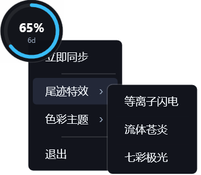

# Codex Monitor

> A lightweight desktop & CLI monitor for OpenAI Codex / ChatGPT Plus & Pro quota tracking.  
> 极轻量的 OpenAI Codex / ChatGPT Plus & Pro 桌面与终端用量监控工具。

<p align="center">
  
  
</p>

<p align="center">
  
  
  
</p>

---

[English](#english) | [中文](#中文)

---

<a name="中文"></a>
## 中文

### 简介
**Codex Monitor** 是一款专为 OpenAI Codex / ChatGPT 订阅用户打造的极轻量用量监控工具。直接读取本地 `~/.codex/auth.json` 登录凭据（兼容 `cc-switch` 等订阅管理工具），实时展示剩余用量百分比、7天重置倒计时与账号订阅到期日。

- ⚡ **智能刷新**：默认每 60 秒后台自动同步一次，支持单击或右键菜单即刻手动刷新。
- 🔄 **自动续期**：检测到 Token 过期时自动调用官方 OAuth 接口刷新并持久化写回凭据文件。

### 核心特性

#### 🪟 Windows 桌面端 (`src/`)
- 基于 C# (.NET 4.8 / WPF) 构建，GPU DirectX 硬件加速渲染，体积仅 ~40 KB。
- 支持**悬浮圆环 (72x72)** 与 **贴边胶囊 (42x96)** 平滑形变。
- **三大流光尾迹**：等离子闪电、东方水墨、七彩极光。
- **三大渐变配色**：蓝靛紫、青碧翠、白金钛。
- 支持右键菜单一键切换开机自启。

#### 🐧 Linux 状态栏与终端 (`linux/`)
- 基于 Go 语言构建的独立可执行程序，单一二进制文件直接运行。
- **系统状态栏常驻**：兼容 GNOME、KDE Plasma、XFCE 等全部桌面环境，在状态栏常驻展示发光进度环与实时用量百分比，支持右键暗黑详情菜单。
- **终端命令行模式**：支持 `--cli` 单次输出彩色仪表盘与 `--watch` 实时守护监控。

---

### 下载与使用

#### 📦 下载预编译版本 (GitHub Releases)
前往 [**Releases 页面**](https://github.com/Scott143-dot/CodexMonitor/releases) 根据您的操作系统与 CPU 架构下载：

| 资产文件名 (File Asset) | 适用操作系统 (OS) | CPU 架构 (Architecture) | 运行方式 |
| :--- | :--- | :--- | :--- |
| **`CodexMonitor-windows-x64.exe`** | **Windows 10 / 11 / Server** | **x86_64 / x64** | 双击直接运行 |
| **`codex-monitor-linux-x86_64.tar.gz`** | **Linux (Ubuntu/Debian/Arch/Fedora)** | **x86_64 / AMD64** | 解压后运行 `./codex-monitor -d` |

- **Linux 常用运行命令**：
  ```bash
  # 启动状态栏托盘 (后台常驻，关闭终端不退出)
  ./codex-monitor -d

  # 终端命令行模式
  ./codex-monitor --cli

  # 终端实时守护监控
  ./codex-monitor --watch
  ```

---

### 源码编译

#### 🪟 Windows
双击运行 `build.bat`，调用系统内置 `csc.exe` 编译生成 `CodexMonitor.exe`。

#### 🐧 Linux
```bash
cd linux
go build -ldflags="-s -w" -o codex-monitor-linux-amd64 main.go
chmod +x codex-monitor-linux-amd64
```

---

### 📂 项目架构

```text
CodexMonitor/
├── .github/workflows/
│   └── release.yml          # GitHub Actions 自动化跨平台编译与 Release 流水线
├── assets/                  # 真实运行展示图片
├── src/                     # Windows C# WPF 源码
│   ├── Program.cs           # 单实例互斥锁与入口
│   ├── ApiService.cs        # 凭据自适应解析与 OpenAI 官方请求
│   ├── ConfigManager.cs     # 本地配置持久化
│   ├── MainWindow.cs        # 悬浮标核心组件与形态变换
│   └── TrailOverlay.cs      # 全屏流光尾迹渲染系统
├── linux/                   # Linux Go 源码
│   ├── go.mod               # Go 模块配置
│   ├── go.sum               # Go 依赖校验
│   └── main.go              # 状态栏托盘与终端一体化源码
├── build.bat                # Windows 本地编译脚本
├── .gitignore               # Git 忽略配置
├── LICENSE                  # MIT 开源协议
└── README.md                # 中英文双语开发文档
```

---
---

<a name="english"></a>
## English

### Introduction
**Codex Monitor** is a lightweight desktop and CLI quota monitor for OpenAI Codex and ChatGPT Plus/Pro users. It reads local `~/.codex/auth.json` credentials (fully compatible with `cc-switch`) to display remaining quota percentages, 7-day reset countdowns, and subscription details in real time.

- ⚡ **Smart Refresh**: Automatically refreshes every 60 seconds in the background, with instant manual refresh on click or via menu.
- 🔄 **OAuth Auto-Renewal**: Automatically renews expired tokens and persists them back to the local credentials file.

### Features

#### 🪟 Windows Desktop (`src/`)
- Built with C# (.NET 4.8 / WPF), GPU DirectX hardware acceleration, single binary ~40 KB.
- Smooth morphing between **Floating Ring (72x72)** and **Docked Capsule (42x96)**.
- **3 Visual Trail Effects**: Plasma Lightning, Traditional Chinese Ink Wash, and Prismatic Aurora.
- **3 Gradient Themes**: Blue-Indigo-Violet, Cyan-Emerald-Forest, Platinum-Gold-Titanium.
- Auto-start toggle via context menu.

#### 🐧 Linux Tray & CLI (`linux/`)
- Built with Go as a standalone single executable binary.
- **System Tray Widget**: Compatible with GNOME, KDE Plasma, XFCE, and other desktop environments. Displays a glowing progress ring with real-time percentage in the top/bottom status bar, with a dark dropdown details menu.
- **CLI Terminal Mode**: Supports `--cli` single output dashboard and `--watch` real-time monitoring.

---

### Download & Usage

#### 📦 Download Precompiled Binaries (GitHub Releases)
Visit the [**Releases Page**](https://github.com/Scott143-dot/CodexMonitor/releases) to download the latest builds for your OS & Architecture:

| Asset File | Operating System (OS) | Architecture | Usage |
| :--- | :--- | :--- | :--- |
| **`CodexMonitor-windows-x64.exe`** | **Windows 10 / 11 / Server** | **x86_64 / x64** | Double click to run |
| **`codex-monitor-linux-x86_64.tar.gz`** | **Linux (Ubuntu/Debian/Arch/Fedora)** | **x86_64 / AMD64** | Unpack and run `./codex-monitor -d` |

- **Linux Common Commands**:
  ```bash
  # Launch System Tray Widget in daemon mode
  ./codex-monitor -d

  # CLI Terminal Dashboard
  ./codex-monitor --cli

  # Real-time monitoring
  ./codex-monitor --watch
  ```

---

### Build from Source

#### 🪟 Windows
Run `build.bat` to compile with the built-in Windows `csc.exe` compiler.

#### 🐧 Linux
```bash
cd linux
go build -ldflags="-s -w" -o codex-monitor-linux-amd64 main.go
chmod +x codex-monitor-linux-amd64
```

---

## License
MIT License © 2026
